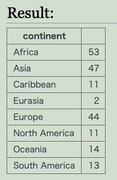

# GROUP BY

- テーブルをケーキのようにカットする
- 「商品分類ごと」や「登録日ごと」などのように切り分けられる
- 必ずFROM句の後ろに置く
  - WHERE句があるならその後ろに置く
- GROUP BY句は結果の順序はランダム
  - 並び順をソートしたいなら、そのための指定をSELECT文でやっておくこと

## 例

```sql
SELECT continent, COUNT(*)
FROM world
GROUP BY continent;
```



WHEREも使える。

```sql
SELECT age, COUNT(*)
FROM users,
WHERE age = 20,
GROUP BY country;
```

usersテーブルから、年齢が20歳で、国ごとで分けた数をカウントする。
